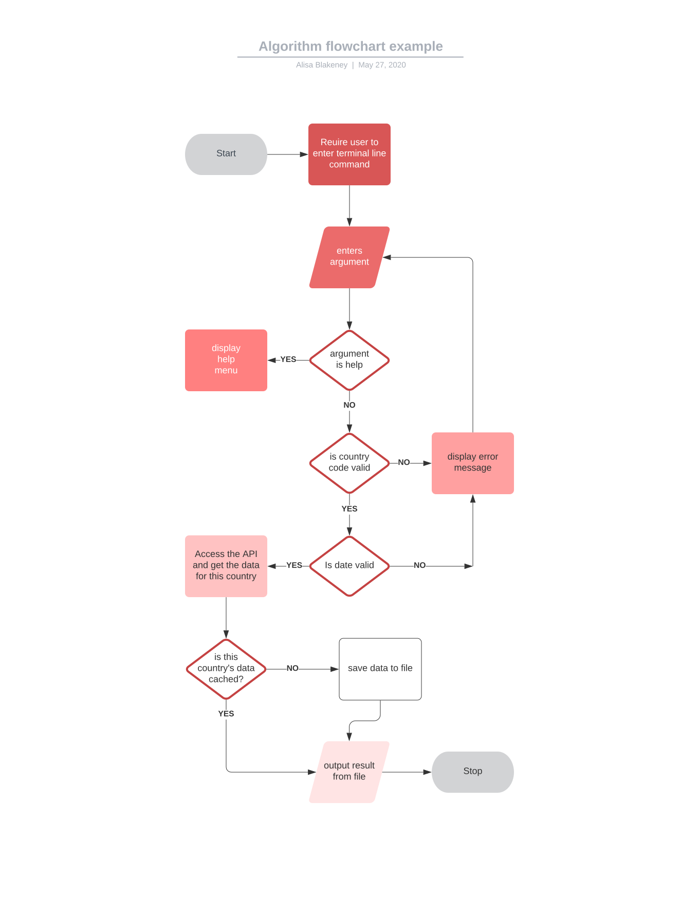

# Coronapp

## Statement of Purpose and Scope

This application provides a user with information related to the spread of COVID-19 internationally. It takes user input in the form of a country code, date, and desired statistic (of daily deaths, daily new cases, total cases, total deaths and total recoveries) and returns a number taken from an API relying on up-to-date World Health Organisation data. The application solves the problem of individuals needing to access information relating to public health, but being overwhelmed by complicated analyses, large amounts of data, or distracting graphical user interfaces. The goal is to allow concerned individuals to evaluate the comparative severity of the disease in different countries in order to inform their personal decisions, including travel plans, distancing strategy or degree of self-satisfaction. The user will use the application by entering a country, chosing which statistic they wish to view and entering a date. This will return a statistic in the form of a sentence string. The user can use the help menu to view a directory of countries and the codes to be used within the command line arguments, a list of statistics that are available, and instructions on date formatting. 


## Installation

* You must have Ruby installed.
* Download the file via zip or git clone into your folder of choice. 
* In your terminal, navigate into src of this project.
* Ensure you have installed bundler gem.
* Run:
```bash 
bundle install
```

## Usage

This app takes three terminal line arguments: country, date and statistic. 

For example, from the src directory, you can run:  

```bash
    ruby controller.rb -c "AU" -d "20 April 2020" -s "toll" 
```

This will return the total deaths from coronavirus in Australia on 20 April this year. 

If you forget these instructions, just run the --help command. 

```bash
    ruby controller.rb -h
```

The available statistics are: 

New --> returns the new cases of coronavirus on this day
Deaths --> returns the number of deaths from coronavirus on this day
Total --> returns the total number of coronavirus cases on this day
Recovered --> returns the number of people who have recovered from coronavirus
Toll --> returns the total number of deaths from coronavirus 

The countries whose statistics can be accessed are: 

    AF Afghanistan      DE Germany          PK Pakistan
    AL Albania          GH Ghana            PS Palestine
    DZ Algeria          GR Greece           PA Panama
    AO Angola           GL Greenland        PG Papua New Guinea
    AR Argentina        GT Guatemala        PY Paraguay
    AM Armenia          GN Guinea           PE Peru
    AU Australia        GW Guinea-Bissau    PH Philippines
    AT Austria          GY Guyana           PL Poland
    AZ Azerbaijan       HT Haiti            PT Portugal
    BS Bahamas          HN Honduras         PR Puerto Rico
    BD Bangladesh       HK Hong Kong        QA Qatar
    BY Belarus          HU Hungary          XK Republic of Kosovo
    BE Belgium          IS Iceland          RO Romania
    BZ Belize           IN India            RU Russia
    BJ Benin            ID Indonesia        RW Rwanda
    BT Bhutan           IR Iran             SA Saudi Arabia
    BO Bolivia          IQ Iraq             SN Senegal
    BA Bosnia/Herz      IE Ireland          RS Serbia
    BW Botswana         IL Israel           SL Sierra Leone
    BR Brazil           IT Italy            SG Singapore
    BN Brunei           JM Jamaica          SK Slovakia
    BG Bulgaria         JP Japan            SI Slovenia
    BF Burkina Faso     JO Jordan           SB Solomon Islands
    BI Burundi          KZ Kazakhstan       SO Somalia
    KH Cambodia         KE Kenya            ZA South Africa
    CM Cameroon         KP Korea            KR South Korea
    CA Canada           XK Kosovo           SS South Sudan
    CI Ivory Coast      KW Kuwait           ES Spain
    CF CAR              KG Kyrgyzstan       LK Sri Lanka
    TD Chad             LA Lao              SD Sudan
    CL Chile            LV Latvia           SR Suriname
    CN China            LB Lebanon          SJ Svalbard and Jan Mayen
    CO Colombia         LS Lesotho          SZ Swaziland
    CG Congo            LR Liberia          SE Sweden
    CD DR Congo         LY Libya            CH Switzerland
    CR Costa Rica       LT Lithuania        SY Syrian Arab Republic
    HR Croatia          LU Luxembourg       TW Taiwan
    CU Cuba             MK Macedonia        TJ Tajikistan
    CY Cyprus           MG Madagascar       TZ Tanzania
    CZ Czechia          MW Malawi           TH Thailand
    DK Denmark          MY Malaysia         TL Timor-Leste
    DP Diamond Princess ML Mali             TG Togo
    DJ Djibouti         MR Mauritania       TT Trinidad and Tobago
    DO Dominican Repub  MX Mexico           TN Tunisia
    CD DR Congo         MD Moldova          TR Turkey
    EC Ecuador          MN Mongolia         TM Turkmenistan
    EG Egypt            ME Montenegro       AE UAE
    SV El Salvador      MA Morocco          UG Uganda
    GQ Equatorial GuineaMZ Mozambique       GB United Kingdom
    ER Eritrea          MM Myanmar          UA Ukraine
    EE Estonia          NA Namibia          US USA
    ET Ethiopia         NP Nepal            UY Uruguay
    FK Falkland Islands NL Netherlands      UZ Uzbekistan
    FJ Fiji             NC New Caledonia    VU Vanuatu
    FI Finland          NZ New Zealand      VE Venezuela
    FR France           NI Nicaragua        VN Vietnam
    GF French Guiana    NE Niger            EH Western Sahara
    TF French ST        NG Nigeria          YE Yemen
    GA Gabon            KP North Korea      ZM Zambia
    GM Gambia           NO Norway           ZW Zimbabwe
    GE Georgia          OM Oman

## Features

This app has three features: 

1. Scrape 

This is a module which defines a static function taking three variables as arguments: country, date and statistic. It scrapes a url using the gem open-uri. This url is taken from an online API, and completed as a string using the country argument. The data returned from this is saved into a local variable. Using the json gem, the same function parses this variable and returns the relevant statistic. In order to do this, it uses a private class to define a function which translates the user-entered statistic into a well-formed string. Error handling inherits from the standard class. I have ensured that user input which is a date object or wrongly capitalized can be handled. 

2. Opt-Parse

This is a class for analysing the arguments entered in the command line by the user, using the Option Parser gem which is bundled with ruby. It specifies the arguments which are mandatory - country, date, and statistic - as well as outlining what type of variable it expects these to be, and automatically generates a help menu for the commands. Using the optparse/date module, I can coerce the string entered as an argument for date into a date object. Opt-parse also allows me to store the arguments in a hash, which is used as an argument in the get function described above. 

3. Main function

This code handles the arguments specified in opt-parse above and returns a string with the scrape module method interpolated. The error handling at this stage rescues an error where there are insufficient arguments and an error where there are invalid arguments and ensures that a well formed error message is returned, which suggests that the user access the help menu.  

4. Elegant error handling

You will find all of your errors handled in the most elegant of ways. Enter insufficient number of arguments in the terminal? Handled, with a polite error message. Enter a country code that does not exist? Handled, with a polite error message. Enter a date before which no person had yet eaten a bat and coronavirus did not exist? You will be astonished yet delighted to know, this is considered an error, and that error is handled. If there are yet errors, I blame the user. 

5. Conditionals

You will find that in the cache function, there is a conditional that provides a json file will only be saved to the computer where this file does not already exist, or the existing file does not have data for the date requested. Is that enough double negatives for you?

## User Interaction and Experience	 

The user will learn how to interact with the application through a README file accessible on the public github repository. This file will explain how to install the app as well as install any dependencies using bundle install. It will also include usage instructions with examples. During use of the application, if a user enters incorrect information – for example, if a user were to enter too few arguments – the application will prompt the user as to the nature of the error and suggest that they view the help menu of the application by typing --help. These choices have been made to closely mirror how command line applications typically function, rather than mimicking the style of a graphical user interface 

## Control Flow Diagram



## Implementation Plan

The things I need to do to make this app are listed below. As I researched how to do these things and then incorporated the results into my code (while continuously testing to ensure performance was as expected), I checked off the items from the list below in trello. 

* Learn how to use github to version control my work
* Write a readme and software development plan including features. 
* Make a control flow diagram of how I expect the app to work.
* Write some tests using rspec about how I expect the program to work
* Learn how to make an executable file that takes arguments from the command line using ARGV
* Find an API that will provide corona virus statistics I am interested in.
* Understand the structure of the API and which options I will need to require from the user in order to return a sensible result. 
* Find a way to make an http call to the API and return the results as json
* Find a way to parse the result
* Fix the errors that the gem is throwing because of its basic settings
* Write a function which takes the arguments and returns the number I am interested in. 
* Find a way of taking arguments from the command line 
* Find a way of generating a help menu 
* Learn how to make a gem using bundle gem coronapp to create a sensible file structure for my app.
* Make a way of caching results 
* Find a way of validating dates entered to ensure that people aren't entering from before or after data exists

See [trello board](https://trello.com/invite/b/pc6pvNan/539072041e9035a6fe2a3abbf52086e8/coronapp) for further details. 

## Manual Testing 

**Test**|**Expected Outcome**|**Actual Outcome**
:-----:|:-----:|:-----:
I enter a search for Australia |A json file is saved to the cache folder which contains the data from the australia webpage |As expected
I enter a search for Australia a second time|The json file above is not modified|As expected
I manually remove the date in my search from the saved Australia cache and search again|The json file above is updated to include the date again|As expected
I enter a search for -c "AU" -d "20 April 2020" -s "deaths"|I will be returned the string "There were 0 new daily deaths on this day"|As expected
I enter a search for -c "AU" -d "40 April 2020" -s "deaths"|I will be returned the message "Invalid argument: -d 40 april 2020. Run "coronapp" --help for details."|As expected
I enter a search for -c "AU" -d  "20 Fleburary 2020" -s "deaths"|I will be returned the message "Invalid argument: -d 20 Fleburary 2020. Run "coronapp" --help for details."|FAIL - returned "There were  new daily deaths on this day" Fix this!
I call the help menu|The help menu is returned|As expected
I call the app without any arguments|I receive the message "Insufficient arguments. Run "coronapp" --help for details."|As expected
I enter a search for -c "XX" -d "20 April 2020" -s "toll"|Mate, I hope it breaks but I'm pretty sure it's not going to because I don't have data validation for this|FAIL - as expected, not having a way of handling this meant that it wasn't handled
I enter a search for --cOuNtRy "uS" --dAtE "24/02/2020" -sTaT "tOtAl"|I will be returned the message "There were 51 total cases on this day"|As expected
